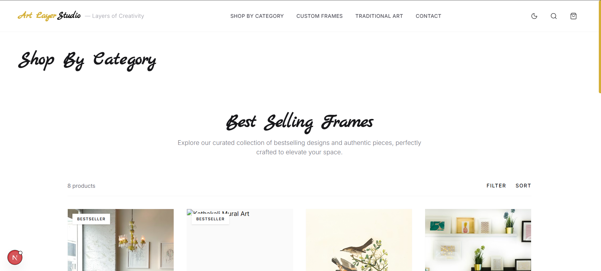

# 🎨 Art Layer Studio

**Art Layer Studio** is a premium, editorial-style web application built with Next.js and React, designed to showcase bespoke framing and creative artwork with a minimalist, high-end aesthetic.

The application delivers a sophisticated user experience with smooth animations, refined typography, and a modern UI that feels both elegant and alive.

---

## ✨ Features

- 🎬 **Custom Animated Preloader** – A cinematic first impression for every visitor.
- 🌗 **Semantic Theming** – Seamless light and dark modes with a custom `ThemeProvider`.
- 🖋 **Elegant Typography** – Featuring *Marck Script* for an editorial touch.
- 🧩 **Modular Architecture** – Clean, reusable React components for scalability.
- 🖼 **Art Showcase** – Interactive gallery modules for high-resolution artwork.
- 🛠 **Bespoke Services** – Dedicated sections for custom framing and design services.
- 📱 **Fully Responsive** – Optimized for premium viewing on all devices.

---

## 🛠 Tech Stack

- **Framework:** [Next.js 14](https://nextjs.org/) (App Router)
- **Library:** [React 18](https://reactjs.org/)
- **Styling:** [Tailwind CSS](https://tailwindcss.com/)
- **Animations:** [Framer Motion](https://www.framer.com/motion/)
- **Tone:** Minimalist, Editorial, Luxury

---

## 📸 Screenshots

### 🏠 Home


### 🖼 Our Studio


### 🛠 Custom Services


### 📩 Contact Us


---

## 🚀 Getting Started

Clone the repository and install dependencies:

```bash
git clone https://github.com/ghsalah/Art-layer.git
cd Art-layer
npm install
```

Start the development server:

```bash
npm run dev
```

---

## 📄 License

This project is licensed under the MIT License - see the [LICENSE](LICENSE) file for details.